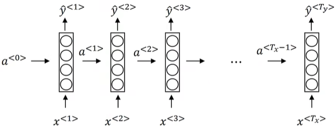

# 自然语言处理

## 序列模型

> eg. speech recognition, music generation, sentiment classification, DNA sequence analysis, machine translation, video activity recognition, name entity recognition(NER)

 $x^{(i)}$ : 第 $i$ 个样本的输入序列， $y^{(i)}$ : 输出序列

 $x^{(i)\langle t\rangle}, y^{(i)\langle t\rangle}$ : 序列中的第 $t$ 个元素

 $T_x^{(i)},T_y^{(i)}$ : 序列的长度

## 循环神经网络 Recurrent NN (RNN)

单个样本：
$$
\begin{align}
a^{\langle0\rangle}&=\vec 0\\
a^{\langle t\rangle}&=g_a(w_{aa}a^{\langle t-1\rangle}+w_{ax}x^{\langle t\rangle}+b_a)\\
&=g_a(w_a\begin{bmatrix}
a^{\langle t-1\rangle} \\
x^{\langle t\rangle}
\end{bmatrix}+b_a),\qquad(w_a=[w_{aa},w_{ax}])\\
\hat y^{\langle t\rangle}&=g_y(w_{ya}a^{\langle t\rangle}+b_y)
\end{align}
$$

> 通常， $g_a$ 取 tanh或ReLU； $g_y$ 由 $y$ 的性质决定，如二分类可用 Sigmoid

### GRU, Gated Recurrent Unit

解决梯度消失（长期依赖）问题

 $c$ : 记忆单元 memory cell

 $c^{\langle 0\rangle}=\vec 0$ 

 $c^{\langle t-1\rangle}=a^{\langle t-1\rangle}$ 

 $\Gamma_r=\sigma(w_r\begin{bmatrix}c^{\langle t-1\rangle} \\x^{\langle t\rangle}\end{bmatrix}+b_r)$ 相关关系

 $c^{\langle t\rangle}$ 的候选值 $\tilde c^{\langle t\rangle}=\tanh(\Gamma_r*w_c\begin{bmatrix}c^{\langle t-1\rangle} \\x^{\langle t\rangle}\end{bmatrix}+b_c)$ 

 $\Gamma_u=\sigma(w_u\begin{bmatrix}c^{\langle t-1\rangle} \\x^{\langle t\rangle}\end{bmatrix}+b_u)$ 更新开关（update gate）

 $c^{\langle t\rangle}=\Gamma_u*\tilde c^{\langle t\rangle}+(1-\Gamma_u)*c^{\langle t-1\rangle}$ 

 $a^{\langle t\rangle}=c^{\langle t\rangle}$ 

> $a^{\langle t\rangle}，c^{\langle t\rangle},\Gamma_u$ shape相同， $*$ 表示按位相乘

### LSTM, Long Short Term Memory units

 $\tilde c^{\langle t\rangle}=\tanh(w_c\begin{bmatrix}c^{\langle t-1\rangle} \\x^{\langle \rangle}\end{bmatrix}+b_c)$ 

 $\Gamma_u=\sigma(w_u\begin{bmatrix}c^{\langle t-1\rangle} \\x^{\langle t\rangle}\end{bmatrix}+b_u)$ 更新开关（update gate）

 $\Gamma_f=\sigma(w_f\begin{bmatrix}c^{\langle t-1\rangle} \\x^{\langle t\rangle}\end{bmatrix}+b_f)$ 遗忘开关（forget gate）

 $\Gamma_o=\sigma(w_o\begin{bmatrix}c^{\langle t-1\rangle} \\x^{\langle t\rangle}\end{bmatrix}+b_o)$ 输出开关（output gate）

 $c^{\langle t\rangle}=\Gamma_u*\tilde c^{\langle t\rangle}+\Gamma_f*c^{\langle t-1\rangle}$ 

 $a^{\langle t\rangle}=\Gamma_o*c^{\langle t\rangle}$ 

### BRNN Bidirectional

### Deep RNN

沿 $y$ 方向堆叠RNN

### pros and cons of RNN

TODO

## 词表示 Word Representation

### One-hot

对于词表 $V$ ，用 $\mathbb{R}^{|V|}$ 的基向量表示所有单词

### 基于SVD的方法

找出某个矩阵 $X$ ，然后进行SVD分解， $X=U\Sigma V^T$ ，取 $U$ 的每一行作为 word embedding，从而达到降维的效果。

#### Word-Document Matrix

对于 $M$ 篇文章，列出矩阵 $X\in \mathbb{R}^{|V|\times M}$ ， $X_{ij}$ 表示单词 $i$ 出现在文章 $j$ 中。

问题： $M$ 会变

#### Window based Co-occurrence Matrix

 $X\in \mathbb{R}^{|V|\times|V|}$ 表示每个单词的周围一个范围内有多少其他单词

对 $X$ SVD分解后，取前若干维作为word embedding

问题：

- 加入新单词导致 $X$ 维度变化
-  $X$ 稀疏且庞大
- SVD分解是二次方复杂度

一些改进措施：

- 忽略常见词（stop words，停词），如 he his the
- 采用带权重的滑动窗口，距离越近权重越高
- 使用协方差矩阵代替简单的计数

### 基于迭代（训练）的方法——word2vec

基于特征的词表示

定义一个模型，其参数是词表示，然后在一些特定的任务上训练模型

一些注解

- Word2vec是一种Bag of words model——与位置无关
- 词嵌入用于类比：man-woman : king-？ $\underset{w}{\arg\max\,}\mathrm{sim}(e_w,e_{\mathrm{king}}-e_{\mathrm{man}}+e_{\mathrm{woman}})$ 
- 对于多义词也可以很好地表示
- 同义词和反义词都在类似的语境中出现，因此基于上下文预测的方式无法很好地区分反义词
- 可视化方法：t-SNE算法投影到二维

#### word2vec: Continuous Bag of Words Model (CBOW)

任务：根据上下文预测中心词，学习输入输出的词表示（学习两个词表示）

Notations：

-  $w^{\langle i\rangle},w_i$ ：分别表示输入序列中的第 $i$ 个单词，和词表中的第 $i$ 个单词。（假设序列中第 $i$ 个单词在词表中的下标是 $j$ ，则 $w^{\langle i\rangle}=w_j$ ）
-  $n$ ：词向量维度，超参数
-  $\mathcal{V} \in \mathbb{R}^{n \times|V|}$ ：表示输入的词向量矩阵，即作为上下文时的词向量
-  $\mathcal{U} \in \mathbb{R}^{|V|\times n}$ ：表示输出的词向量矩阵，即作为中心词时的词向量
-  $u^{\langle i\rangle},u_i$ ：同 $w^{\langle i\rangle},w_i$ 

-  $c$ ：中心词在序列中的位置
-  $m$ ：上下文窗口半径，即选取 $[c-m,c+m]$ 范围内的单词，即

输入上下文的词表示： $(v^{\langle c-m\rangle},\cdots,v^{\langle c-1\rangle},v^{\langle c+1\rangle},\cdots,v^{\langle c+m\rangle})$ 

这些词向量的平均值记为 $\hat v=\dfrac{v^{\langle c-m\rangle}+\cdots+v^{\langle c-1\rangle}+v^{\langle c+1\rangle}+\cdots+v^{\langle c+m\rangle}}{2m}$ 

对于单词 $i,j$ ，相似度通过点积计算，即 $u_i^Tv_j$ ，将所有输出单词的词向量放在一起，得到评分向量： $z=\mathcal U\hat v\in\mathbb R^{|V|}$ 

通过softmax将评分转化为概率，即输出 $\hat y=\text{softmax}(z)\in\mathbb R^{|V|}$ ，表示每个单词是中心词的概率，而ground truth是真实中心词的one hot表示

损失函数取交叉熵 $J(\hat y,y)=H(\hat y,y)=-\sum_{j=1}^{|V|}y_j\log(\hat y_j)$ ，由于 $y$ 是中心词的one hot表示，假设中心词在词表的下标是 $i$ （只有 $y_i=1$ ），于是
$$
\begin{align}
J(\hat y,y)&=-\log(\hat y_i)\qquad=-\log P(u^{\langle c\rangle}|v^{\langle c-m\rangle},\cdots,v^{\langle c-1\rangle},v^{\langle c+1\rangle},\cdots,v^{\langle c+m\rangle})\\
&=-\log(\text{softmax}(z_i))\\
&=-\log \frac{\exp(u_i^{T} \hat{v})}{\sum_{j=1}^{|V|} \exp(u_j^{T} \hat{v})} \\
&=-u_{i}^{T} \hat{v}+\log \sum_{j=1}^{|V|} \exp(u_{j}^{T} \hat{v})
\end{align}
$$

#### word2vec: Skip-Gram Model

类似CBOW，只是反过来

任务：根据中心词预测上下文，学习输入输出的词表示（学习两个词表示）

Notations:

- 同CBOW，不同点如下：
- $\mathcal{V} \in \mathbb{R}^{n \times|V|}$ 表示中心词（同样是输入的词向量矩阵）
- $\mathcal{U} \in \mathbb{R}^{|V|\times n}$ 表示上下文

评分向量 $z=\mathcal Uv^{\langle c\rangle}\in\mathbb R^{|V|}$ ，转化为概率： $\hat y=\text{softmax}(z)\in\mathbb R^{|V|}$ ，即对于单词 $w_i$ ，其在 $w^{\langle c\rangle}$ 周围 $m$ 范围内出现的概率 $P(u_i|v^{\langle c\rangle})=\hat y_i$ 

对于某一个中心词 $w^{\langle c\rangle}$ ，似然函数表达为：
$$
\begin{align}
\text {Likelihood}&=L(\theta)=P(u^{\langle c-m\rangle},\cdots,u^{\langle c-1\rangle},u^{\langle c+1\rangle},\cdots,u^{\langle c+m\rangle}|v^{\langle c\rangle})\\
&=\prod_{\substack{-m \leq j \leq m \\ j \neq 0}} P(u^{\langle c+j\rangle}|v^{\langle c\rangle})\qquad \text{(Naive Bayes assumption)}
\end{align}
$$
损失函数取负对数似然：
$$
\begin{align}
J_c(\hat y,y)&=-\log L(\theta)\\
&=-\sum_{\substack{-m \leq j \leq m \\ j \neq 0}} \log P(u^{\langle c+j\rangle}|v^{\langle c\rangle})\qquad \text{(Naive Bayes assumption)}\\
&=-\sum_{\substack{-m \leq j \leq m \\ j \neq 0}} \log \hat y^{\langle c+j\rangle}\\
&=-\sum_{\substack{-m \leq j \leq m \\ j \neq 0}} \log \frac{\exp(u^{\langle c+j\rangle}\cdot v^{\langle c\rangle})}{\sum_{k=1}^{|V|} \exp(u_k\cdot v^{\langle c\rangle})} \\
&=-\sum_{\substack{-m \leq j \leq m \\ j \neq 0}} u^{\langle c+j\rangle}\cdot v^{\langle c\rangle}+2m\log\sum_{k=1}^{|V|} \exp(u_k^{T} v^{\langle c\rangle})
\end{align}
$$
总损失为所有中心词的平均：
$$
J=\dfrac1T\sum_{c=1}^TJ_c
$$
注：

- 为了简化求导，每个单词有两个词向量 $v_w,u_w$ ，（通常）最终结果取两者平均值。
-  $J_c=-\sum_{\substack{-m \leq j \leq m \\ j \neq 0}} \log P(u^{\langle c+j\rangle}|v^{\langle c\rangle})=\sum_{\substack{-m \leq j \leq m \\ j \neq 0}} H(\hat y,y^{\langle c+j\rangle})$ ，概率向量 $\hat y$ 和one-hot向量 $y^{\langle c+j\rangle}$ 的交叉熵就是负对数似然。所以损失函数也可以看做交叉熵。
- 反向传播的结果：

$$
\begin{align}
\dfrac{\partial P(o|c)}{\partial v^{\langle c\rangle}}&=u^{\langle o\rangle}-\sum_{x=1}^{|V|}P(x|c)u_x\\
&=\text{observed}-\text{expected}
\end{align}
$$

#### word2vec Optimization: Negative Sampling

Distributed Representations of Words and Phrases and their Compositionality

$\sum_{w\in V}$ 代价较大，尝试近似：从词表中随机取 $K$ 个单词，采样的分布是 $P_n(w)$ ，一般认为较好的分布是Unigram的 $3/4$ 次方（放大罕见词的概率）。

## Seq2Seq

Beam search

### BLEU

存在多个可选的输出时（如机器翻译）使用的评价指标，越大越好

n-gram上的Bleu score:
$$
p_n=\dfrac{\sum\limits_{\text{n-grams}\in\hat y}\mathrm{Count_clip}(\text{n-gram})}{\sum\limits_{\text{n-grams}\in\hat y}\mathrm{Count}(\text{n-gram})}
$$

Combined Bleu score:
$$
\mathrm{BP}\cdot\exp(\dfrac14\sum_{n=1}^4p_n)
$$
BP指brevity penalty，用于惩罚短句子
$$
\mathrm{BP}=\begin{cases}
1 & \text{if } \hat T>T^* \\
\exp(1-\dfrac{\hat T}{T^*}) &\text { otherwise }
\end{cases}
$$
 $\hat T,T^*$ 分别指模型预测的句子长度和ground truth的句子长度

## 语言模型 Language Model

### 定义

输入：序列，输出：该序列存在的概率，即 $P(w_1,\cdots,w_n)$ 

基于条件概率直接展开： $P(w_1,\cdots,w_n)=P(w_1)P(w_2|w_1)\cdots P(w_n|w_1w_2\cdots w_{n-1})$ 

应用 $N-1$ 阶马尔科夫假设得到 N-gram 模型

Unigram model：假设每个单词独立，即 $P(w_{1}, w_{2}, \cdots, w_{n})=\prod_{i=1}^{n} P(w_{i})$ 

Bigram model：仅考虑连续两个单词的相关性，即 $P(w_{1}, w_{2}, \cdots, w_{n})=P(w_1)\cdot\prod_{i=2}^{n} P(w_{i}|w_{i-1})$ 

Trigram model： $P(w_{1}, w_{2}, \cdots, w_{n})=P(w_1)P(w_2|w_1)\cdot\prod_{i=3}^{n} P(w_{i}|w_{i-1},w_{i-2})$ 

### 评估

#### Perplexity

> 困惑度

越小越好

$$
\text{Perplexity}=\sqrt[n]{\dfrac1{P(w_1,\cdots,w_n)}}=\exp({\dfrac1n\log P(w_1,\cdots,w_n)})
$$

TODO: 如何理解困惑度

### 神经语言模型 NLM

Word2vect，GloVe，Elmo，Bert

## 注意力机制

 机器翻译为例： $t,t'$ 分别是输出和输入句子的下标， $s^{\langle t\rangle},a^{\langle t\rangle}$ 分别是输出和输入RNN的激活值。

 $\alpha^{\langle t,t'\rangle}$ 表示生成 $y^{\langle t\rangle}$ 时，对 $a^{\langle t'\rangle}$ 的注意力，用softmax计算
$$
\alpha^{\langle t,t'\rangle}=\dfrac{\exp(e^{\langle t,t'\rangle})}{\sum_{t'=1}^{T_x}\exp(e^{\langle t,t'\rangle})}
$$
 $e^{\langle t,t'\rangle}$ 由 $s^{\langle t-1\rangle}$ 和 $a^{\langle t'\rangle}$ 通过一个神经网络得到。

总体复杂度为二次方

[Bahdanau et.al.,2014.Neural machine translation by jointly learning to align and translate]

[Xu et. al., 2015.Show attention and tell: neural image caption generation with visual attention]

## Transformers

### 自注意力机制 Self-Attention

Intuition:

- Attention: idea
- CNN: parallel

Self-Attention=Attention+CNN

第 $i$ 个token $x^{\langle i\rangle}$ 的Attention表达为：
$$
A^{\langle i\rangle}=A(q^{\langle i\rangle}, K, V)=\sum_{i} \frac{\exp \left(q^{\langle i\rangle} \cdot k^{\langle i\rangle}\right)}{\sum_{j} \exp \left(q^{\langle i\rangle} \cdot k^{\langle j\rangle}\right)} v^{\langle i\rangle}
$$
其中， $q^{\langle i\rangle}=W^Q\cdot x^{\langle i\rangle},k^{\langle i\rangle}=W^K\cdot x^{\langle i\rangle},v^{\langle i\rangle}=W^V\cdot x^{\langle i\rangle}$ 

向量化，对所有token同时计算，也叫做Scaled dot-product attention：
$$
\mathrm{Attention}(Q, K, V)=\mathrm{softmax}\left(\frac{Q K^{T}}{\sqrt{d_{k}}}\right) V
$$
Attention重复做若干次，则为Multihead Attention 多头注意力
